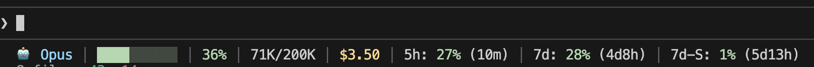
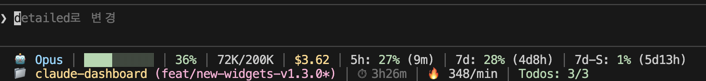
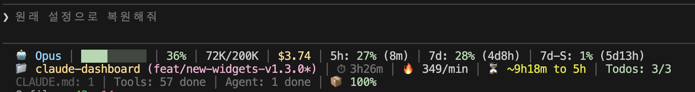

# claude-dashboard


Comprehensive status line plugin for Claude Code with context usage, API rate limits, cost tracking, and modular widget system.

## Demo


## Features

- 🤖 **Model Display**: Shows current model (Opus, Sonnet, Haiku)
- 📊 **Progress Bar**: Color-coded context usage (green → yellow → red)
- 📈 **Token Count**: Current/total tokens in K/M format
- 💰 **Cost Tracking**: Cumulative session cost in USD
- ⏱️ **Rate Limits**: 5h session limit with reset countdown, 7d usage (supports day units: 3d2h)
- 📁 **Project Info**: Directory name with git branch (* for uncommitted changes)
- 🔧 **Config Counts**: CLAUDE.md, rules, MCPs, hooks counts
- ⚙️ **Tool Activity**: Running/completed tools tracking
- ⏱️ **Session Duration**: Session time tracking
- 🤖 **Agent Status**: Subagent progress tracking
- ✓ **Todo Progress**: Task completion rate
- 🔥 **Burn Rate**: Token consumption per minute
- 📦 **Cache Hit**: Cache hit rate percentage
- ⏳ **Depletion Time**: Estimated time to rate limit
- 🔷 **Codex Usage**: OpenAI Codex CLI usage (model, 5h/7d limits) - auto-detected
- 💎 **Gemini Usage**: Google Gemini CLI usage (model, usage %) - auto-detected
- 🟠 **Z.ai/ZHIPU Usage**: z.ai/ZHIPU GLM usage (5h tokens, 1m MCP) - auto-detected
- 🌐 **i18n**: English and Korean support (auto-detect)
- 📐 **Multi-line**: Compact (1), Normal (2), Detailed (4) line modes

### Coming Soon

- 🎨 **Color Themes**: Choose from multiple color themes (pastel, classic, high-contrast)

## Output Examples

**Compact (1 line) - Default:**



**Normal (2 lines):**



**Detailed (4 lines):**



> `*` after branch name indicates uncommitted changes in git

**With z.ai/ZHIPU (4th line shows z.ai usage):**

```
🟠 GLM │ ████████░░ 80% │ 160K/200K │ $1.25 │ 5h: 42% (2h30m) │ 7d: 69%
📁 project (main*) │ ⏱ 45m │ 🔥 351/min │ ⏳ ~2h30m │ ✓ 3/5
CLAUDE.md: 2 │ ⚙️ 12 done │ 🤖 Agent: 1 │ 📦 85%
🟠 GLM │ 5h: 42% (2h30m) │ 1m: 15% (25d3h)
```

> 🟠 indicates z.ai/ZHIPU provider. Shows 5-hour token usage and monthly MCP usage with reset countdown.

## Installation

### From Plugin Marketplace

```
/plugin marketplace add uppinote20/claude-dashboard
/plugin install claude-dashboard
/claude-dashboard:setup
```

### Manual Installation

1. Clone the repository:
```bash
git clone https://github.com/uppinote20/claude-dashboard.git ~/.claude/plugins/claude-dashboard
```

2. Run setup:
```
/claude-dashboard:setup
```

## Configuration

### Interactive Mode

Run `/claude-dashboard:setup` without arguments to use interactive mode:

```
/claude-dashboard:setup
→ Display mode? [compact/normal/detailed/custom]
→ (For custom: select widgets for each line)
```

> **Note**: Interactive mode is best for preset selection (compact/normal/detailed).
> For custom mode, widget order follows the option list order, and only 4 widgets
> can be shown per question. For full control, use **Direct Mode** or edit the JSON file.

### Direct Mode

```bash
# Preset modes
/claude-dashboard:setup compact             # 1 line (default)
/claude-dashboard:setup normal en pro       # 2 lines, English, Pro plan
/claude-dashboard:setup detailed ko max     # 3 lines, Korean, Max plan

# Custom mode: full control over widget order and line composition
# Format: "widget1,widget2,...|widget3,widget4,..." (| separates lines)
/claude-dashboard:setup custom auto max "model,context,cost|projectInfo,todoProgress"
/claude-dashboard:setup custom auto max "model,projectInfo,cost,rateLimit5h"  # 1 line, custom order
/claude-dashboard:setup custom auto max "context,model|todoProgress,sessionDuration|configCounts"  # 3 lines
```

### Available Widgets

| Widget | Description |
|--------|-------------|
| `model` | Model name with emoji |
| `context` | Progress bar, percentage, tokens |
| `cost` | Session cost in USD |
| `rateLimit5h` | 5-hour rate limit |
| `rateLimit7d` | 7-day rate limit (Max only) |
| `rateLimit7dSonnet` | 7-day Sonnet limit (Max only) |
| `projectInfo` | Directory name + git branch (* if dirty) |
| `configCounts` | CLAUDE.md, rules, MCPs, hooks |
| `sessionDuration` | Session duration |
| `toolActivity` | Running/completed tools |
| `agentStatus` | Subagent progress |
| `todoProgress` | Todo completion rate |
| `burnRate` | Token consumption per minute |
| `cacheHit` | Cache hit rate percentage |
| `depletionTime` | Estimated time to rate limit (approx)¹ |
| `codexUsage` | OpenAI Codex CLI usage (auto-hide if not installed)² |
| `geminiUsage` | Google Gemini CLI usage - current model (auto-hide if not installed)³ |
| `geminiUsageAll` | Google Gemini CLI usage - all models (auto-hide if not installed)³ |
| `zaiUsage` | z.ai/ZHIPU usage (auto-hide if not using z.ai)⁴ |

> ¹ **Depletion time approximation**: Assumes all current utilization came from this session. May be inaccurate if session started with pre-existing usage or multiple concurrent sessions are running. Estimate improves as session runs longer.
>
> ² **codexUsage**: Auto-hides if Codex CLI is not installed (~/.codex/auth.json)
>
> ³ **geminiUsage**: Auto-hides if Gemini CLI is not installed (~/.gemini/oauth_creds.json)
>
> ⁴ **zaiUsage**: Auto-hides if not using z.ai/ZHIPU (detected via ANTHROPIC_BASE_URL)

### Display Mode Presets

| Mode | Lines | Line 1 | Line 2 | Line 3 | Line 4 |
|------|-------|--------|--------|--------|--------|
| `compact` | 1 | model, context, cost, rateLimit5h, rateLimit7d, rateLimit7dSonnet | - | - | - |
| `normal` | 2 | (same as compact) | projectInfo, sessionDuration, burnRate, todoProgress | - | - |
| `detailed` | 4 | (same as compact) | projectInfo, sessionDuration, burnRate, depletionTime, todoProgress | configCounts, toolActivity, agentStatus, cacheHit | codexUsage, geminiUsage, zaiUsage |

### Configuration File

Settings are stored in `~/.claude/claude-dashboard.local.json`:

```json
{
  "language": "auto",
  "plan": "max",
  "displayMode": "compact",
  "cache": {
    "ttlSeconds": 60
  }
}
```

**Custom configuration:**
```json
{
  "language": "auto",
  "plan": "max",
  "displayMode": "custom",
  "lines": [
    ["model", "context", "cost", "rateLimit5h"],
    ["projectInfo", "todoProgress"]
  ],
  "cache": {
    "ttlSeconds": 60
  }
}
```

## Requirements

- **Claude Code** v1.0.80+
- **Node.js** 18+

## Color Legend

| Color | Usage % | Meaning |
|-------|---------|---------|
| 🟢 Green | 0-50% | Safe |
| 🟡 Yellow | 51-80% | Warning |
| 🔴 Red | 81-100% | Critical |

## Plan Differences

| Feature | Max | Pro |
|---------|-----|-----|
| 5h rate limit | ✅ | ✅ |
| Reset countdown | ✅ | ✅ |
| 7d all models | ✅ | ❌ |

## Troubleshooting

### Status line not showing

1. Check if plugin is installed: `/plugin list`
2. Verify settings.json has statusLine config
3. Restart Claude Code

### Rate limits showing ⚠️

- API token may be expired - re-login to Claude Code
- Network issue - check internet connection
- API rate limited - wait 60 seconds for cache refresh

### Wrong language

Run setup with explicit language:
```
/claude-dashboard:setup normal ko  # Korean
/claude-dashboard:setup normal en  # English
```

### Cache Issues

API response cache is stored in `~/.cache/claude-dashboard/`. To clear:

```bash
rm -rf ~/.cache/claude-dashboard/
```

Cache files are automatically cleaned up after 1 hour.

## Commands

### `/claude-dashboard:setup`

Configure the status line display mode, language, and plan. See [Configuration](#configuration) section above.

### `/claude-dashboard:check-usage`

Check usage limits for all AI CLIs (Claude, Codex, Gemini, z.ai) at once and get a recommendation for which CLI has the most available capacity.

```bash
# Interactive output with colors
/claude-dashboard:check-usage

# JSON output for scripting
/claude-dashboard:check-usage --json

# Specify language (en or ko)
/claude-dashboard:check-usage --lang ko
```

**Example output:**

```
════════════════════════════════════════
          CLI Usage Dashboard
════════════════════════════════════════

[Claude]
  5h: 25% (4h10m)  |  7d: 18% (4d20h)

[Codex]
  5h: 0% (4h59m)  |  7d: 1% (3d8h)  |  Plan: plus

[Gemini]
  gemini-2.0-flash        0% (57m)
  gemini-2.5-flash        0% (57m)
  gemini-2.5-flash-lite   1% (57m)
  gemini-2.5-pro          2% (12h57m)
  gemini-3-flash-preview  0% (57m)
  gemini-3-pro-preview    2% (12h57m)

════════════════════════════════════════
Recommendation: codex (Lowest usage (0% used))
════════════════════════════════════════
```

## Development

```bash
# Install dependencies
npm install

# Build
npm run build

# Test locally
echo '{"model":{"display_name":"Opus"},"workspace":{"current_dir":"/tmp"},"context_window":{"context_window_size":200000,"current_usage":{"input_tokens":50000,"output_tokens":0,"cache_creation_input_tokens":0,"cache_read_input_tokens":0}},"cost":{"total_cost_usd":0.5}}' | node dist/index.js
```

## License

MIT
